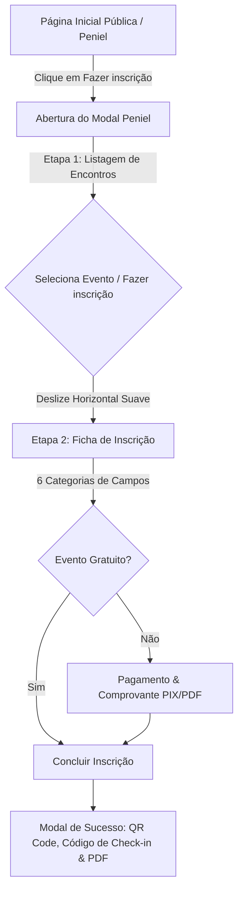

# Fluxo de Inscrição Peniel — Modal Deslizante e Responsivo

Este documento detalha o fluxo de inscrição pública do Peniel, refatorado para oferecer uma experiência unificada e moderna, estilo "mobile-first" com transições deslizantes horizontais, além de correções associadas de autenticação no sistema.

---

## 1. Visão Geral do Fluxo de Inscrição

Anteriormente, o processo de inscrição do Peniel direcionava o usuário para uma página de promoção externa ou utilizava um painel lateral do tipo gaveta (*drawer*) que continha um formulário extenso e sem divisões claras de etapas. 

O novo fluxo centraliza a experiência de inscrição em um **modal de tema claro, limpo e dinâmico**, acessível tanto a partir da página inicial do sistema quanto da página pública dedicada do Peniel.



---

## 2. Componentes e Integrações

### A. [PenielRegistrationModal.tsx](file:///d:/projetos/FRONTBACK/saaschurch-nextjs/src/components/public/PenielRegistrationModal.tsx) [NOVO]
Este é o componente principal que abriga toda a lógica de inscrição. Ele gerencia:
- O carregamento da lista de encontros futuros e ativos via API.
- A animação de deslize horizontal utilizando CSS (`translateX` no contêiner com largura de `200%`).
- O formulário dividido em 6 categorias visuais claras.
- A validação de contatos obrigatórios (mínimo de 3 contatos de emergência preenchidos).
- O fluxo condicional de upload de comprovantes ou agendamento de data de pagamento.
- A geração dinâmica do comprovante de inscrição em PDF no próprio navegador via `jsPDF`, acompanhado de QR Code gerado por `qrcode`.
- A integração com a fila de espera quando as vagas principais do encontro estão esgotadas.

### B. [PublicHome.tsx](file:///d:/projetos/FRONTBACK/saaschurch-nextjs/src/components/public/PublicHome.tsx) [MODIFICADO]
- O botão principal de "Inscrições Peniel" foi modificado para não mais redirecionar de página. Agora ele abre diretamente o `PenielRegistrationModal`, permitindo que os usuários se inscrevam sem sair da página inicial.

### C. [PenielPublicPage.tsx](file:///d:/projetos/FRONTBACK/saaschurch-nextjs/src/components/public/PenielPublicPage.tsx) [MODIFICADO]
- Foram removidas mais de 600 linhas de código duplicado e formulários manuais do antigo *drawer*.
- Foi integrado o `PenielRegistrationModal`. Quando o usuário clica em "Fazer minha inscrição" na agenda ao fim da página de promoção, o modal abre diretamente na etapa do formulário com aquele evento já pré-selecionado (`initialSelectedEvent`).

---

## 3. Categorias da Ficha de Inscrição (Formulário)

O formulário de inscrição é agrupado em blocos lógicos estruturados para manter a clareza visual e facilitar o preenchimento em dispositivos móveis:

1. **Dados Pessoais**: Nome Completo, Endereço, Data de Nascimento, Estado Civil, Idade, WhatsApp e Igreja base.
2. **Célula / Grupo Familiar**: Checkbox de participação, nome da célula e nome do líder (exibidos condicionalmente).
3. **Informações Especiais (Dinâmicas)**: Exibe campos baseados nas configurações do evento (`extraFieldsConfig` no banco de dados):
   - Nome do Cônjuge
   - Detalhes de filhos (nomes e idades)
   - Congregação e Cargo Eclesiástico
4. **Contatos de Emergência**: Espaço para citar as 5 pessoas mais importantes da vida do inscrito, sendo as 3 primeiras obrigatórias (com nome, WhatsApp, parentesco e relação).
5. **Motivação e Expectativas**: Respostas dissertativas sobre quem motivou a inscrição, o porquê de participar e as expectativas.
6. **Dados Físicos & Saúde**: Peso, Altura, medicamentos de uso contínuo, alergias/restrições e presença de apneia do sono (ronco).

---

## 4. Botões e Ações de Navegação

Para garantir clareza no processo e evitar referências prematuras de pagamento para inscrições sem custos, os botões seguem a seguinte nomenclatura:

*   **Na Listagem de Eventos**: Botão **"Fazer minha inscrição"** para selecionar o encontro.
*   **No Fim do Formulário (Dados)**:
    *   Para eventos com valor > 0: Botão **"Avançar"** (direciona para a tela de comprovante).
    *   Para eventos gratuitos (valor = 0): Botão **"Concluir"** (finaliza a inscrição imediatamente).
*   **No Fim do Formulário de Pagamento**: Botões **"Enviar com comprovante"** e **"Enviar sem comprovante (pagar depois)"**.

---

## 5. Correções de Manutenção Associadas

### Autenticação no Gerenciamento de Igrejas (`Churches.tsx`)
Durante os testes de integração do painel administrativo, foi identificada e corrigida uma falha onde a tabela de listagem de igrejas exibia a mensagem vermelha de **"Não autenticado."**.

- **Problema**: O endpoint `/api/campos` passou a exigir autenticação (`withAuth`) no backend, mas o componente [Churches.tsx](file:///d:/projetos/FRONTBACK/saaschurch-nextjs/src/components/app-ui/Churches.tsx) realizava a busca como `fetchJson('/campos')` sem informar que a rota requeria o envio do token JWT.
- **Solução**: A chamada no método `loadBaseData` foi corrigida para:
  ```typescript
  fetchJson('/campos', {}, { requiresAuth: true })
  ```
  Isso anexa o Bearer token correto ao cabeçalho da requisição e soluciona o travamento da visualização administrativa de igrejas.
